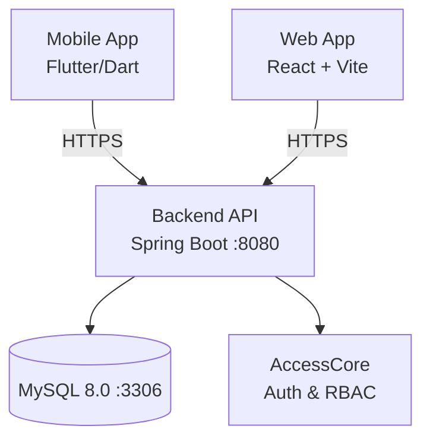

<p align="center">
  
</p>

<h1 align="center">VitAfrica — Hospital Management System</h1>

<p align="center">
  <strong>SaaS hospital & clinic management platform for African healthcare facilities</strong>
  <br>
  <em>Digitalizing Healthcare for a Reliable Future</em>
</p>

---

## Table of Contents

- [Overview](#overview)
- [Problem Statement](#problem-statement)
- [Architecture](#architecture)
- [Tech Stack](#tech-stack)
- [Components](#components)
  - [Backend API](#backend-api)
  - [AccessCore](#accesscore)
  - [Web App](#web-app)
  - [Mobile App](#mobile-app)
- [Getting Started](#getting-started)
- [API Overview](#api-overview)
- [Security](#security)
- [Deployment](#deployment)
- [License](#license)

---

## Overview

VitAfrica is a specialized **Hospital/Clinic Management System** designed to digitalize medical processes in African contexts. The platform replaces manual, paper-based workflows with a reliable digital infrastructure serving administrators, doctors, staff, and patients across two interfaces: a **web portal** for clinical management and a **mobile application** for patient self-service.

The system is organized as a **monorepo** containing four interconnected components.

---

## Problem Statement

Healthcare facilities in target regions face critical operational challenges:

- **Data Integrity** — Paper files are prone to loss, duplication, and deterioration
- **Operational Efficiency** — Manual appointment scheduling and pharmacy tracking consume excessive time and resources
- **Financial Transparency** — Billing processes lack centralization, leading to errors and revenue leakage

VitAfrica addresses these issues through a unified digital platform with role-based access control, automated workflows, and real-time data synchronization.

---

## Architecture

```
vitafrica/
├── backend/          # Spring Boot REST API (Java 17)
├── accesscore/       # Reusable authentication & RBAC library
├── web-app/          # Admin/Doctor/Staff web portal (React + TypeScript)
├── mobile-app/       # Patient mobile application (Flutter)
├── doc/              # Documentation (English & French)
├── docker-compose.yml
├── railway.json
└── .env
```

The backend and accesscore are Java modules built with Maven. AccessCore is a reusable library installed to the local Maven repository and consumed as a dependency by the backend. The web frontend and mobile app each consume the REST API independently.

### Infrastructure



---

## Tech Stack

| Component | Language | Framework | Build Tool | Major Dependencies |
|-----------|----------|-----------|------------|--------------------|
| **Backend API** | Java 17 | Spring Boot 3.4.2 | Maven | Spring Security, JPA/Hibernate, JWT (jjwt), MySQL Connector, SpringDoc OpenAPI, Lombok |
| **AccessCore** | Java 17 | Spring Boot 3.4.2 | Maven | Spring Security, JPA/Hibernate, JWT (jjwt), Lombok |
| **Web App** | TypeScript 5.9 | React 19 | Vite 7 | Tailwind CSS 4, Lucide React |
| **Mobile App** | Dart 3.10+ | Flutter | Flutter SDK | http, shared_preferences, flutter_svg, image_picker, url_launcher |

---

## Components

### Backend API

The core REST API serving both the web portal and mobile application. Exposes endpoints for patient management, clinical workflows, pharmacy inventory, billing, and administrative operations.

**Key packages:**

| Package | Responsibility |
|---------|---------------|
| `config/` | Security (CORS, JWT filter), web configuration, data initialization (seeds roles & default admin), exception handling |
| `domain/model/` | JPA entities: Patient, Doctor, Staff, Admin, Appointment, Prescription, VitalSign, LabResult, Department, and enums |
| `domain/repository/` | Spring Data JPA repositories |
| `service/` | Business logic for all user roles and file uploads |
| `controller/mobile/` | Mobile-facing endpoints (`/api/patients/mobile/**`) |
| `controller/web/` | Web-facing endpoints (`/api/admin/**`, `/api/doctor/**`, `/api/staff/**`, `/api/authentication/web/**`) |
| `dto/` | Request and response DTOs |

### AccessCore

A reusable authentication & authorization library providing:

- User registration & login with JWT + refresh token flow
- Role-Based Access Control (RBAC) with fine-grained resource-level permissions
- Role management and resource-to-role assignment

AccessCore exposes its own API surface (`/api/clients/**`, `/api/roles/**`, `/api/resources/**`) which the backend's security chain integrates into a unified authentication flow.

### Web App

Administrative and medical web portal for three user roles:

- **Admin** — Dashboard with system stats, personnel management (CRUD), department management, registration request approval workflow
- **Doctor** — Consultation queue with filtering/search, prescription and lab result creation, appointment completion
- **Staff** — Patient directory, appointment scheduling, vital signs recording

Built with React 19 + Vite 7 + Tailwind CSS 4. Communicates with the API via JWT-secured HTTP requests.

### Mobile App

Patient-facing mobile application providing:

- Secure authentication via phone number or email
- Personal health dashboard (prescriptions, lab results)
- Appointment history and billing overview
- Profile management

Built with Flutter. Connects to the backend API at `https://vitafrica-production.up.railway.app`.

---

## Getting Started

### Prerequisites

- Java 17+
- Node.js 20+
- Flutter SDK 3.10+
- Docker & Docker Compose (for backend + database)
- MySQL 8.0 (if running without Docker)

### Backend (Docker)

```bash
docker compose up
```

The backend starts on `http://localhost:8080` with Swagger UI at `/swagger-ui/index.html`.

### Backend (Standalone)

```bash
# Build and install AccessCore
cd accesscore
mvn clean install -DskipTests

# Build and run the backend
cd ../backend
mvn clean install -DskipTests
mvn spring-boot:run -Dspring-boot.run.profiles=dev
```

### Web App

```bash
cd web-app
npm install
npm run dev
```

### Mobile App

```bash
cd mobile-app
flutter pub get
flutter run
```

---

## API Overview

### Mobile Endpoints

| Method | Endpoint | Description |
|--------|----------|-------------|
| POST | `/api/patients/mobile/register` | Patient registration |
| POST | `/api/patients/mobile/login` | Patient authentication |
| GET | `/api/patients/mobile/home` | Patient dashboard data |
| GET | `/api/patients/mobile/appointments` | Patient appointments |
| GET | `/api/patients/mobile/prescriptions` | Patient prescriptions |
| GET | `/api/patients/mobile/lab-results` | Patient lab results |
| GET | `/api/patients/mobile/profile` | Patient profile |

### Web Authentication

| Method | Endpoint | Description |
|--------|----------|-------------|
| POST | `/api/authentication/web/register` | Register web user (pending approval) |
| POST | `/api/authentication/web/login` | Web user authentication |
| GET | `/api/authentication/web/me` | Current user info |

### Admin Endpoints (`ADMIN` role)

| Method | Endpoint | Description |
|--------|----------|-------------|
| GET | `/api/admin/stats` | System statistics |
| GET | `/api/admin/requests` | Pending registration requests |
| POST | `/api/admin/requests/{id}/approve` | Approve registration |
| POST | `/api/admin/requests/{id}/reject` | Reject registration |
| GET/POST/DELETE | `/api/admin/personnel` | Personnel management |
| GET/POST/DELETE | `/api/admin/departments` | Department management |

### Doctor Endpoints (`DOCTOR` role)

| Method | Endpoint | Description |
|--------|----------|-------------|
| GET | `/api/doctor/dashboard` | Doctor dashboard |
| GET | `/api/doctor/consultations` | Consultation list |
| GET | `/api/doctor/consultations/{id}` | Consultation details |
| POST | `/api/doctor/consultations/{id}/prescription` | Write prescription |
| POST | `/api/doctor/consultations/{id}/lab-result` | Upload lab result |
| PATCH | `/api/doctor/consultations/{id}/complete` | Complete consultation |

### Staff Endpoints (`STAFF` role)

| Method | Endpoint | Description |
|--------|----------|-------------|
| GET | `/api/staff/dashboard` | Staff dashboard |
| GET | `/api/staff/patients` | Patient directory |
| GET | `/api/staff/doctors` | Doctor directory |
| POST | `/api/staff/appointments` | Schedule appointment |
| POST | `/api/staff/vital-signs` | Record vital signs |

---

## Security

- **Authentication**: JWT-based (24h access token + 7-day refresh token)
- **Authorization**: Role-Based Access Control (RBAC) with roles: `PATIENT`, `DOCTOR`, `STAFF`, `ADMIN`, `USER` (pending web users)
- **Registration flow**: Web users register as `USER` (pending) and require admin approval; mobile patients register directly as `PATIENT`
- **CORS**: Configured for localhost, Vercel deployments, and Railway production
- **Data protection**: Medical records restricted to authorized personnel by role-based API access

---

## Deployment

The backend is deployed on **Railway** using Docker. Configuration is defined in `railway.json`:

```json
{
  "build": { "builder": "DOCKERFILE", "dockerfilePath": "backend/Dockerfile" },
  "deploy": { "startCommand": "java -jar app.jar", "restartPolicyType": "ON_FAILURE", "restartPolicyMaxRetries": 5 }
}
```

The web app targets **Vercel** for frontend hosting.

---

## License

MIT © 2026 Rayane BICABA — see [LICENSE](LICENSE).
