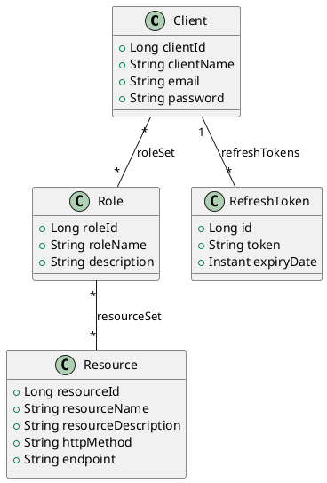

**AccessCore — Auth & RBAC réutilisable**

**Résumé :**
- **AccessCore** est un module Spring Boot fournissant l'authentification (inscription + login), la gestion de JWT + Refresh Token, et un système RBAC (roles ↔ resources) réutilisable pour protéger des endpoints.

**Fonctionnalités principales :**
- **Inscription** d'un client avec rôle par défaut (`app.default.role`).
- **Authentification** (login) qui retourne un `accessToken` JWT et un `refreshToken` persistant.
- **Gestion des rôles** : création de rôles, assignation de ressources aux rôles.
- **Gestion des ressources** : création de ressources (nom technique, méthode HTTP, endpoint).
- **Assignation de rôles** aux clients.

**Fichiers-clés (lecture rapide) :**
- Contrôleurs : [accesscore/src/main/java/com/pankassi/accesscore/controller/AuthenticationController.java](accesscore/src/main/java/com/pankassi/accesscore/controller/AuthenticationController.java#L1) | [accesscore/src/main/java/com/pankassi/accesscore/controller/ClientController.java](accesscore/src/main/java/com/pankassi/accesscore/controller/ClientController.java#L1) | [accesscore/src/main/java/com/pankassi/accesscore/controller/RoleController.java](accesscore/src/main/java/com/pankassi/accesscore/controller/RoleController.java#L1) | [accesscore/src/main/java/com/pankassi/accesscore/controller/ResourceController.java](accesscore/src/main/java/com/pankassi/accesscore/controller/ResourceController.java#L1)
- Modèles : [accesscore/src/main/java/com/pankassi/accesscore/domain/model/Client.java](accesscore/src/main/java/com/pankassi/accesscore/domain/model/Client.java#L1) | [accesscore/src/main/java/com/pankassi/accesscore/domain/model/Role.java](accesscore/src/main/java/com/pankassi/accesscore/domain/model/Role.java#L1) | [accesscore/src/main/java/com/pankassi/accesscore/domain/model/Resource.java](accesscore/src/main/java/com/pankassi/accesscore/domain/model/Resource.java#L1) | [accesscore/src/main/java/com/pankassi/accesscore/domain/model/RefreshToken.java](accesscore/src/main/java/com/pankassi/accesscore/domain/model/RefreshToken.java#L1)
- Services JWT / Refresh : [accesscore/src/main/java/com/pankassi/accesscore/service/JwtService.java](accesscore/src/main/java/com/pankassi/accesscore/service/JwtService.java#L1) | [accesscore/src/main/java/com/pankassi/accesscore/service/RefreshTokenService.java](accesscore/src/main/java/com/pankassi/accesscore/service/RefreshTokenService.java#L1)
- Configuration sécurité : [accesscore/src/main/java/com/pankassi/accesscore/config/SecurityConfig.java](accesscore/src/main/java/com/pankassi/accesscore/config/SecurityConfig.java#L1)
- Propriétés : [accesscore/src/main/resources/application.properties](accesscore/src/main/resources/application.properties#L1)

**Modèles de données (résumé)**
- `Client` (table `Client`)
	- `clientId: Long` (PK)
	- `clientName: String`
	- `email: String` (unique)
	- `password: String` (hashé)
	- `roleSet: Set<Role>` (ManyToMany)

- `Role` (table `Role`)
	- `roleId: Long` (PK)
	- `roleName: String` (unique)
	- `description: String`
	- `resourceSet: Set<Resource>` (ManyToMany)

- `Resource` (table `Resource`)
	- `resourceId: Long` (PK)
	- `resourceName: String` (code technique, ex. `BOOK_CREATE`)
	- `resourceDescription: String`
	- `httpMethod: String` (GET/POST/...)
	- `endpoint: String` (pattern Ant, ex. `/api/books`)

- `RefreshToken` (table `refresh_token`)
	- `id: Long` (PK)
	- `token: String` (unique)
	- `client: Client` (ManyToOne)
	- `expiryDate: Instant`

**Diagramme de classes (PlantUML)**


**Flux d'authentification (résumé)**
1. Inscription (`/api/clients/register`) : `ClientRequest(email, username, password)` → crée un `Client` et lui assigne le rôle par défaut (`app.default.role`). Voir [AuthenticationController](accesscore/src/main/java/com/pankassi/accesscore/controller/AuthenticationController.java#L1) et [AuthenticationService](accesscore/src/main/java/com/pankassi/accesscore/service/AuthenticationService.java#L1).
2. Connexion (`/api/clients/login`) : `LoginRequest(email, password)` → si ok :
	 - Génère `accessToken` (JWT) via `JwtService.generateToken(client)` (les rôles et ressources du client sont ajoutés dans la revendication `authorities`).
	 - Crée un `RefreshToken` persistant via `RefreshTokenService.createRefreshToken(client)`.
	 - Retourne `AuthenticationResponse(accessToken, refreshToken, email, clientName)`.
3. Vérification/usage : le `accessToken` inclut les claims `authorities` (p. ex. `ROLE_USER`, `BOOK_CREATE`), utilisables pour autoriser l'accès via Spring Security (ex. `@PreAuthorize`). `JwtService.isTokenValid(...)` permet vérifier côté serveur.
4. Refresh token : `RefreshTokenService.verifyExpiration(...)` vérifie et nettoie les tokens expirés.

**Endpoints exposés**
- `POST /api/clients/register` — Inscription
	- Requête: `ClientRequest { email, username, password }` ([ClientRequest](accesscore/src/main/java/com/pankassi/accesscore/dto/request/ClientRequest.java#L1))
	- Réponse: `ClientResponse { clientName, clientEmail, roles }` ([ClientResponse](accesscore/src/main/java/com/pankassi/accesscore/dto/response/ClientResponse.java#L1))

- `POST /api/clients/login` — Connexion
	- Requête: `LoginRequest { email, password }` ([LoginRequest](accesscore/src/main/java/com/pankassi/accesscore/dto/request/LoginRequest.java#L1))
	- Réponse: `AuthenticationResponse { accessToken, refreshToken, email, clientName }` ([AuthenticationResponse](accesscore/src/main/java/com/pankassi/accesscore/dto/response/AuthenticationResponse.java#L1))

- `POST /clients/{email}/roles` — Assigner des rôles à un client
	- Requête: `AssignRolesRequest { email, roles: Set<String> }` ([AssignRolesRequest](accesscore/src/main/java/com/pankassi/accesscore/dto/request/AssignRolesRequest.java#L1))
	- Réponse: `ClientResponse`

- `POST /api/roles` — Créer un rôle
	- Requête: `RoleRequest { name, description }` ([RoleRequest](accesscore/src/main/java/com/pankassi/accesscore/dto/request/RoleRequest.java#L1))
	- Réponse: `RoleResponse { roleId, roleName, roleDescription }` ([RoleResponse](accesscore/src/main/java/com/pankassi/accesscore/dto/response/RoleResponse.java#L1))

- `POST /api/roles/resources` — Assigner des resources à un rôle
	- Requête: `AssignResourcesRequest { roleName, resources: Set<String> }` ([AssignResourcesRequest](accesscore/src/main/java/com/pankassi/accesscore/dto/request/AssignResourcesRequest.java#L1))
	- Réponse: `RoleResponse`

- `POST /api/resources` — Créer une ressource
	- Requête: `ResourceRequest { name, description, httpMethod, endpoint }` ([ResourceRequest](accesscore/src/main/java/com/pankassi/accesscore/dto/request/ResourceRequest.java#L1))
	- Réponse: `ResourceResponse` (implémentation dans `dto.response`)

**Exemples JSON**
- Inscription (`POST /api/clients/register`)
```json
{
	"email": "alice@example.com",
	"username": "alice",
	"password": "secret123"
}
```

- Login (`POST /api/clients/login`)
```json
{
	"email": "alice@example.com",
	"password": "secret123"
}
```

**Configuration importante**
- Propriétés principales (voir [application.properties](accesscore/src/main/resources/application.properties#L1)) :
	- `app.default.role` (valeur par défaut: `USER`)
	- `app.jwt.secret` (clé HMAC pour signer les JWT) — **remplacer par une vraie clé sécurisée en prod**
	- `app.jwt.expiration` (ms) — exemple du repo: `86400000` (1 jour)
	- `app.jwt.refresh-expiration` (ms) — exemple: `604800000` (7 jours)

**Sécurité actuelle**
- `SecurityConfig` autorise actuellement toutes les requêtes (`anyRequest().permitAll()`), ce qui est probablement temporaire pour le développement. Voir [SecurityConfig](accesscore/src/main/java/com/pankassi/accesscore/config/SecurityConfig.java#L1). Pour production, il faut :
	- Activer la vérification des JWT via un filtre qui extrait le token, valide avec `JwtService`, et charge les `authorities`.
	- Restreindre les endpoints sensibles avec `hasRole('ROLE_ADMIN')` ou `hasAuthority('BOOK_CREATE')`.

**Conseils d'intégration rapide**
- Migrer la clé `app.jwt.secret` vers un secret manager / variable d'environnement.
- Ajouter un filtre JWT (ou configurer `SecurityFilterChain`) pour vérifier `Authorization: Bearer <token>`.
- Lier chaque `Resource` à l'URL et méthode réelle de votre API, puis utiliser les `resourceName` comme authorities quand vous protégez les endpoints.
